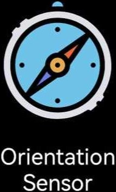
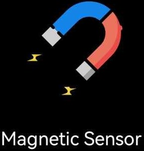

# 1.6¿Que sensores tiene su smartphone vía APP?
<h2>Brian Ulises Nava Villagrana -- 19211692</h2>

| Sensor | Imagen | Descripcion |
|------|------|-----------|
| Acelerometro |  | El sensor acelerómetro se aplica para detectar las direcciones del dispositivo, es decir, la pantalla de rotación automática cuando el dispositivo se gira verticalmente. También se utiliza ampliamente en el desarrollo de juegos. |
|Sensor de Luz|  |Se aplica un sensor de luz para detectar la intensidad de la luz del entorno y luego ajusta el brillo de la pantalla y determina si se apaga la luz del teclado.|
|Sensor de Orientacion|  |El sensor de orientación se aplica para detectar el estado de dirección del dispositivo, es decir, la pantalla de rotación automática cuando el dispositivo se gira horizontalmente. También se puede utilizar como equipo de medición como nivel de burbuja.|
|Sensor de Proximidad|  |El sensor de proximidad mide la distancia entre dos objetos, generalmente la pantalla del dispositivo y nuestras manos/cara, etc. |
|Giroscopio|  |El sensor giroscópico puede medir seis direcciones a la vez. El sensor de giroscopio se utiliza principalmente en el desarrollo de juegos en 3D y, posiblemente, en la navegación en interiores en el futuro.|
|Microfono|  |El sensor de sonido detecta la intensidad del sonido a su alrededor y le proporciona información detallada sobre los cambios.|
|Sensor Magnetico|  |El campo magnético se utiliza en muchas áreas, como la detección de metales y la brújula, lo que nos brinda mucha comodidad en nuestra vida.|
